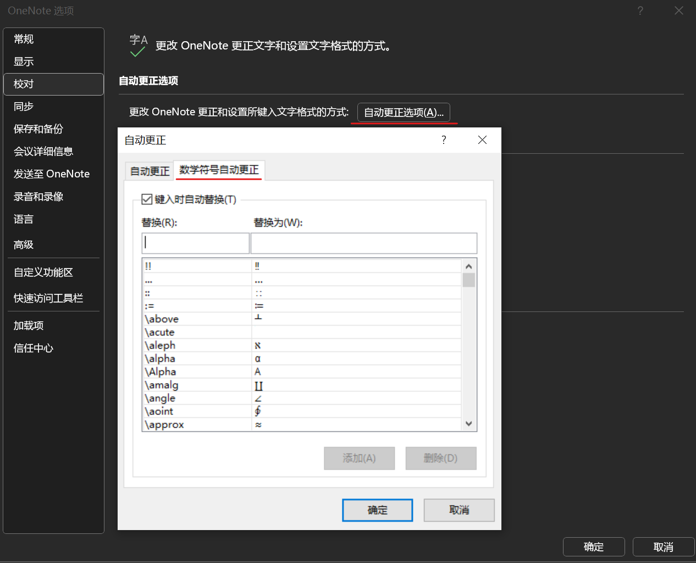

# OneHotkey -- 公式输入简化工具

这是一个用于简化 `OneNote` 和 `Word` 中数学公式输入的 `AutoHotKey` 脚本，例如，`\a` 代表 $\alpha$ (`\alpha`)。

- This is a script that simplifies math formula inputs in `OneNote` and `Word` with `AutoHotKey` script, e.g., `\a` for $\alpha$ (`\alpha`).
- English version of introduction: [README_EN.md](README_EN.md)

展示视频（早期版本）：
- [OneNote快速数学公式输入实战演示1](https://www.bilibili.com/video/BV1wpB6B5E5J/)
- [AutoHotKey增强OneNote公式输入_测试1_哔哩哔哩_bilibili](https://www.bilibili.com/video/BV1Jp421S78r/)

这一项目还在开发中，欢迎你的建议和参与。

如果网页公式显示异常，请阅读：[README.pdf](README.pdf)

## 如何使用

1. 下载并运行[OneHotkey.exe](https://github.com/RUSRUSHB/OneHotkey/raw/main/OneHotkey.exe)。
2. 输入代码，然后按`Space`键输出符号与公式。例如，输入`\a`，然后按`Space`键，就会输出 $\alpha$ 。

更多：

3. 想要自行修改公式映射，请参考[映射自定义指南](#映射自定义指南)。如果需要帮助，请前往[AutoHotKey官网](https://www.autohotkey.com)。
4. 想要停止脚本，用鼠标右键点击系统状态栏中的`H`图标，然后选择`Exit`。

## 目录

<!-- TOC -->

- [OneHotkey -- 公式输入简化工具](#onehotkey----%E5%85%AC%E5%BC%8F%E8%BE%93%E5%85%A5%E7%AE%80%E5%8C%96%E5%B7%A5%E5%85%B7)
    - [如何使用](#%E5%A6%82%E4%BD%95%E4%BD%BF%E7%94%A8)
    - [目录](#%E7%9B%AE%E5%BD%95)
    - [符号映射](#%E7%AC%A6%E5%8F%B7%E6%98%A0%E5%B0%84)
        - [概览](#%E6%A6%82%E8%A7%88)
        - [完整映射表格](#%E5%AE%8C%E6%95%B4%E6%98%A0%E5%B0%84%E8%A1%A8%E6%A0%BC)
            - [常用字符](#%E5%B8%B8%E7%94%A8%E5%AD%97%E7%AC%A6)
            - [运算符](#%E8%BF%90%E7%AE%97%E7%AC%A6)
            - [希腊字母](#%E5%B8%8C%E8%85%8A%E5%AD%97%E6%AF%8D)
            - [矩阵](#%E7%9F%A9%E9%98%B5)
            - [修饰符](#%E4%BF%AE%E9%A5%B0%E7%AC%A6)
            - [箭头](#%E7%AE%AD%E5%A4%B4)
            - [其他符号](#%E5%85%B6%E4%BB%96%E7%AC%A6%E5%8F%B7)
            - [结构](#%E7%BB%93%E6%9E%84)
            - [花体字母](#%E8%8A%B1%E4%BD%93%E5%AD%97%E6%AF%8D)
            - [多列等式](#%E5%A4%9A%E5%88%97%E7%AD%89%E5%BC%8F)
    - [更多建议](#%E6%9B%B4%E5%A4%9A%E5%BB%BA%E8%AE%AE)
    - [实验性功能experimental/文件夹内](#%E5%AE%9E%E9%AA%8C%E6%80%A7%E5%8A%9F%E8%83%BDexperimental%E6%96%87%E4%BB%B6%E5%A4%B9%E5%86%85)
    - [映射自定义指南](#%E6%98%A0%E5%B0%84%E8%87%AA%E5%AE%9A%E4%B9%89%E6%8C%87%E5%8D%97)

<!-- /TOC -->

## 符号映射

### 概览

此脚本包括多种类型的符号映射，包括希腊字母、数学字体、常用字母和结构。以下是其中的一些映射。请确保您已经使用`Alt`+`=`进入了公式输入模式。

|输入|输出|分类|实际代码|
|----|------|----|---|
|`\a`| $\alpha$ |小写希腊字母|`\alpha `|
|`\D`| $\Delta$ |大写希腊字母|`\Delta `|
|`\R`, `\C`, `\Z`, `\N`, `\J`| ℝ, ℂ, ℤ, ℕ, 𝕁 |常用双线体字母|`\doubleR `, ...|
|`\do X`, `\sc X`, `\fr X`| 𝕏, 𝒳, 𝔛 |花体字母|`\doubleX `, `\scriptX `, `\frakturX `|
|`\m3`, `\m4`, ..., `\m`|特定形状矩阵|矩阵|`[\matrix(@@&&)] `, ...|
|`x\h`, `x\~`, `x\d2`| $\hat{x}$, $\tilde{x}$, $\ddot{x}$ |修饰符|`\hat  `, `\tilde  `, `\ddot  `|
|`\x`, `\X`, `\sq`, `\pa`, `\eq`| $\cdot$, $\times$, $\sqrt{⬚}$, $\parallel$, $\equiv$ |运算符|`\cdot `, `\times`, `\sqrt  `, `\parallel `, `\equiv `|
|`\pd`, `\d`, `\dt`, `\inf`| $\partial$, $\text{d}$, $\frac{\text{d}}{\text{d}t}$, $\infty$ |常用符号|`\partial `, `"d" `, `"d" /"d" t `, `\infty `|
|`\limx`, `\limx0`| $ \lim_{x \rightarrow \infty} $, $ \lim_{x \rightarrow 0} $ |极限|`lim_(x->\infty ) `, `lim_(x->0 ) `|
|`\ls`| $^⬚_⬚ P$ |左侧上下标|`^_ P `|
|`\i`, `\j`, `\k`| $\text{i}$, $\text{j}$, $\text{k}$ |虚数/四元数符号|`"i"`, `"j"`, `"k"`|
|`\ejw`| $e^{j\omega}$ |复指数旋转因子|`e^j\omega  `|

你应该注意到` `(空格键)是常用的，这是OneNote公式输入的关键特性。

### 完整映射表格

OneNote 原版的映射可以在这里找到：

> [文件] - [选项] - [校对] - [自动更正选项] - [数学符号自动更正]

#### 常用字符

| 输入 | 输出| 源代码 | 输入 | 输出| 源代码 |
|------|--------|--------|------|--------|--------|
| `\pd` | $\partial$ | `\partial{Space}` |`\d`|$\text{d}$|`"d"{Space}`|
| `\inf` | $\infty$ | `\infty{Space}` | `\dt` | $\frac{\text{d}}{\text{d}t}$ | `"d"{Space}/"d"{Space}t{Space}{Left 4}^i` |
| `\R` | $\mathbb{R}$ | `\doubleR{Space}` | `\E`|$\mathbb{E}[⬚]$|`\doubleE{Space}[]{Space}{Left}`|
| `\Q` | $\mathbb{Q}$ | `\doubleQ{Space}` | `\Z` | $\mathbb{Z}$ | `\doubleZ{Space}` |
| `\N` | $\mathbb{N}$ | `\doubleN{Space}` | `\C` | $\mathbb{C}$ | `\doubleC{Space}` |
| `\J` | $\mathbb{J}$ | `\doubleJ{Space}` | `\n` | $\nabla$ | `\nabla{Space}` |

#### 运算符

| 输入 | 输出| 源代码 | 输入 | 输出| 源代码 |
|------|--------|--------|------|--------|--------|
| `\x` | $\cdot$ | `\cdot{Space}` | `\X` | $\times$ | `\times{Space}` |
| `\sq` | $\sqrt{⬚}$ | `\sqrt{Space 2}{Left}` | `\pa` | $\parallel$ | `\parallel{Space}` |
| `\ss` | $\subset$ | `\subset{Space}` | `\sse` | $\subseteq$ | `\subseteq{Space}` |
| `\op` | $\oplus$ | `\oplus{Space}` | `\ox` | $\otimes$ | `\otimes{Space}` |
| `\od` | $\odot$ | `\odot{Space}` | `\dd` | $\ddots$ | `\ddots{Space}` |
| `\cd` | $\cdots$ | `\cdots{Space}` | `\vd` | $\vdots$ | `\vdots{Space}` |
| `\map` | $\mapsto$ | `\mapsto{Space}` | `\pro` | $\propto$ | `\propto{Space}` |
| `\as` | $\because$ | `\because{Space}` | `\so` | $\therefore$ | `\therefore{Space}` |
| `\eq` | $\equiv$ | `\equiv{Space}` | `\deq` | $\triangleq$ | `\Deltaeq{Space}` |
| `\xe` | $\times 10^{⬚}$ | `\times{Space}10{^}{Space}{Left}` | `\ex` | $\exists$ | `\exists{Space}` |
| `\fa` | $\forall$ | `\forall{Space}` | `\ppd` | $\frac{\partial}{\partial}$ | `\partial{Space}/\partial{Space 2}{Left 3}` |

#### 希腊字母

| 输入 | 输出| 源代码 | 输入 | 输出| 源代码 |
|------|--------|--------|------|--------|--------|
| `\a` | $\alpha$ | `\alpha{Space}` | `\b` | $\beta$ | `\beta{Space}` |
| `\e` | $\varepsilon$ | `\varepsilon{Space}` | `\ve` | $\epsilon$ | `\epsilon{Space}` |
| `\de` | $\delta$ | `\delta{Space}` | `\D` | $\Delta$ | `\Delta{Space}` |
| `\s` | $\sigma$ | `\sigma{Space}` | `\S` | $\Sigma$ | `\Sigma{Space}` |
| `\l` | $\lambda$ | `\lambda{Space}` | `\L` | $\Lambda$ | `\Lambda{Space}` |
| `\t` | $\theta$ | `\theta{Space}` | `\T` | $\Theta$ | `\Theta{Space}` |
| `\p` | $\phi$ | `\phi{Space}` | `\P` | $\Phi$ | `\Phi{Space}` |
| `\o` | $\omega$ | `\omega{Space}` | `\O` | $\Omega$ | `\Omega{Space}` |
| `\g` | $\gamma$ | `\gamma{Space}` | `\G` | $\Gamma$ | `\Gamma{Space}` |

- `ve` 指的是epsilon的变体(variant epsilon)。为了方便，`\e`被设置为 $\varepsilon$ ，`\ve`被设置为 $\epsilon$ 。这和它们的原始代码相反。

#### 矩阵

| 输入 | 输出| 源代码 |
|------|--------|--------|
| `\m4` | 4×4空白矩阵 | `[\matrix(@@@&&&){Space}]{Space}` |
| `\m3` | 3×3空白矩阵 | `[\matrix(@@&&){Space}]{Space}` |
| `\m2` | 2×2空白矩阵 | `[\matrix(@&){Space}]{Space}` |
| `\m` | 空白矩阵，输入`&` `@`来设置大小 | `[]{Space}{Left}\matrix(){Left}` |

#### 修饰符

| 输入 | 输出| 源代码 |
|------|--------|--------|
| `\d1` | $\dot{x}$ | `\dot{Space 2}` |
| `\d2` | $\ddot{x}$ | `\ddot{Space 2}` |
| `\d3` | 上方有3个点 | `\dddot{Space 2}` |
| `\d4` | 上方有4个点 | `\ddddot{Space 2}` |
| `\~` | $\tilde{x}$ | `\tilde{Space 2}` |
| `\v` | $\vec{x}$ | `\vec{Space 2}` |
| `\h` | $\hat{x}$ | `\hat{Space 2}` |
| `\ub` | $\underline{x}$ | `\underbar{Space 2}{Left}` |

- 对于以上代码，你应当输入的代码形如`x\h  `。

#### 箭头

| 输入 | 输出| 源代码 | 输入 | 输出| 源代码 |
|------|--------|--------|------|--------|--------|
| `\lr` | $\leftrightarrow$ | `\leftrightarrow{Space}` | `\Lr` | $\Leftrightarrow$ | `\Leftrightarrow{Space}` |
| `\lrs` | $\leftrightarrows$ | `\leftrightarrows{Enter}{Left}` | `\la` | $\leftarrow$ | `\leftarrow{Space}` |
| `\La` | $\Leftarrow$ | `\Leftarrow{Space}` | `\ra` | $\rightarrow$ | `\rightarrow{Space}` |
| `\Ra` | $\Rightarrow$ | `\Rightarrow{Space}` | `\down` | $\downarrow$ | `\downarrow{Space}` |
| `\up` | $\uparrow$ | `\uparrow{Space}` |

#### 其他符号

| 输入 | 输出| 源代码 | 输入 | 输出| 源代码 |
|------|--------|--------|------|--------|--------|
| `\deg` | $\degree$ | `\degree{Space}` | `\st` | $\star$ | `\star{Space}` |

#### 结构

| 输入 | 输出| 源代码 |
|------|--------|--------|
| `\r` | $\lbrace⬚$ | `\right.{Left}` |
| `\leb` | $⬚\rbrace$ | `\left\box{Space 2}{Left}` |
| `\ceil` | $\lceil⬚\rceil$ | `\lceil{Space}\rceil{Space 2}{Left}` |
| `\floor` | $\lfloor⬚\rfloor$ | `\lfloor{Space}\rfloor{Space 2}{Left}` |
| `\brak` | ⟨⬚⟩ |`\bra{Space}\ket{Space 2}{Left}`|
| `\ls` | $^⬚_⬚ P$ | `^_ P {Left 4}` |
| `\ab` | $\stackrel{⬚}{x}$ | `\above{Space 2}{Left}` |
| `\be` | $\underset{⬚}{x}$ | `\below{Space 2}{Left}` |
| `\abb` | $\overbrace{x}$ | `\overbrace{Space 2}` |
| `\beb` | $\underbrace{x}$ | `\underbrace{Space 2}` |
| `\fu` | $\text{myfunction}{⬚}$ | `\funcapply  ` |
| `\Norm` | $\Vert⬚\Vert$ | `\norm{Space}\norm{Space 2}{Left}` |
| `\limx`, `\limx0` | $ \lim_{x \rightarrow \infty} $, $ \lim_{x \rightarrow 0} $ | `lim_(x->\infty{Space}){Space}`, `lim_(x->0{Space}){Space}` |
| `\limt`, `\limt0` | $ \lim_{t \rightarrow \infty} $, $ \lim_{t \rightarrow 0} $ | `lim_(t->\infty{Space}){Space}`, `lim_(t->0{Space}){Space}` |
| `\limn`, `\limk` | $ \lim_{n \rightarrow \infty} $, $ \lim_{k \rightarrow \infty} $ | `lim_(n->\infty{Space}){Space}`, `lim_(k->\infty{Space}){Space}` |
| `\limh` | $ \lim_{h \rightarrow 0} $ | `lim_(h->0{Space}){Space}` |
| `\BO` | $\boxed{⬚}$ | `\boxed{Enter}{Left 2}` |
| `\qu` | 全角空格 | `\quad{Enter}{Left}` |
| `\diverge` | $\frac{\partial}{\partial x}+\frac{\partial}{\partial y}+\frac{\partial}{\partial z}$ | 略 |
| `\gradient` | $\frac{\partial}{\partial x}\vec{a}_x+\frac{\partial}{\partial y}\vec{a}_y+\frac{\partial}{\partial z}\vec{a}_z$ | 略 |
| `\curl` | 旋度矩阵 |  |

- `\funcapply` 与 `\of` 有些许不同。建议自行尝试一下。

#### 花体字母

| 输入 | 输出| 源代码 |
|------|--------|--------|
| `\sc` | $\mathcal{X}$ | `\script` |
| `\do` | $\mathbb{X}$ | `\double` |
| `\fr` | $\mathfrak{X}$ | `\fraktur` |

- 对于以上代码，你实际应当输入的内容形如`\sc X `。

#### 多列等式

| 输入 | 输出| 源代码 |
|------|--------|--------|
| `\eq2` | 两列等式 | `\eqarray(&=@&=){Space}{Left 6}` |
| `\eqs` | 示例等式数组 | `\eqarray(a\quad&b@c\quad&e){Enter}{Left 11}` |

注：多列等式用于对齐多个等式，使用 `@` 作为占位符，使用 `&` 作为对齐点。

#### 定理结构

| 输入 | 输出| 源代码 |
|------|--------|--------|
| `\pf` | Proof 结构 | `^bProof.^b{Enter 2}!={Space}{#}\qed{Enter}{Left 7}` |
| `\thm` | Theorem 结构 | `^bTheorem{Space}.^b^i{Space}{Left 2}` |
| `\que` | Question 结构 | `^bQuestion{Space}.^b{Space}{Left 2}` |

## 更多建议

- 了解更多关于公式输入的内容：[UTN28-PlainTextMath-v3.pdf](https://www.unicode.org/notes/tn28/UTN28-PlainTextMath-v3.pdf)。第39~47页非常有用。
- 直接输入Unicode数学符号：<https://github.com/gtj1/symbol_assist>
- 符合直觉的类Vim文本光标控制：<https://github.com/RUSRUSHB/AutoTextCursor>

## 实验性功能(`experimental/`文件夹内)

`key_combination.exe`

- 使用组合键输入特别字符、结构
- 包括：进入公式输入、分割线、boxed text、text block

`rus_hotkey.exe`

- 输入俄语字母。这可以和公式输入适应。
- 输入格式：`\`+罗马转写+`R`
- 例子：`\dR`输出д，`\DR`输出Д

## 映射自定义指南

想要自定义映射，请编辑`OneHotkey.ahk`，使用`Ahk2Exe`进行编译，然后运行编译后的`.exe`文件。建议你从[AutoHotKey官网](https://www.autohotkey.com)了解更多关于`AutoHotKey`的知识。

`OneHotkey.ahk`中的代码非常容易理解，即使你没有学习过`AutoHotKey`。对于新手，代码的解释如下：

代码的每一行都是一个输入到符号的映射。格式为`:(参数):输入::输出`。例如，`::\a::\alpha `意味着当你输入`\a`时，脚本会输出`\alpha `。

脚本使用了全局热字串设置 `#Hotstring c o ?`，这些选项对所有映射生效：

|参数|作用|
|-|-|
|`c`|区分大小写，比如`\a`和`\A`是不同的。|
|`o`|删除你在代码末尾输入的`空格键`。|
|`?`|即使代码紧跟在数字或字母后面，它也能正常输出。否则，在像是`x\h`的情况下它不会输出。|
